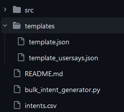
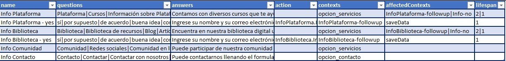

# Bulk Intent Generator for Dialogflow ES - Python
This tool is an extention and was based on the project https://github.com/RohanGautam/bulk-intent-upload developed by https://github.com/RohanGautam
This Bulk Intent Generator was created to automatize the creation of intents for an Agent created in **Dialogflow ES**. The code reads a CSV file with the information required to create the intent, and the tool exports the JSON files to import them into the Dialogflow console.
## Requirements
To run this tool, you will need Python 3 and the libraries `csv json copy codecs`. 
The folder structure required is the same of the repository:



The intents folder must exist, the intents.csv file must have the correct structure and you need the JSON template files in the templates folder.

## How it works?
The program look for the file `intents.csv` in the same folder of the `bulk_intent_generator.py` file.
The code extracts the information of each intent, makes a copy of both templates, add the information into the JSON structure and exports the JSON file in the intents folder. I added an internal function to change the encoding of the JSON file to UTF8 to ensure that the special characters are shown correctly in the Dialogflow console.

## Language configuration
The code generates the intents only for one language, and the default is `es` (spanish). You can change it editing the line 12 in the code of the `bulk_intent_generator.py` file:

```
# Set the language of the Agent
language = 'es'
```

## intents.csv Structure
The CSV file must have this structure:



There are seven columns separated by **,** and each row it's an intent. If the information of one column includes more than one element, the internal elements are separeted by **|**.
This is the explanation of each column:
**name** The name of the intent
**questions** A list of the user expressions separated by **|**.
**answers** A list of Text responses separated by **|**.
**action** The action field is a simple convenience field that assists in executing logic in your service. It's also used for followup intents.
**contexts** A list of the input contexts separated by **|**.
**affectedContexts** A list of the output contexts separated by **|**.
**lifespan** A list of the values of the lifespan of the output contexts separated by **|**. *This list must have the same number of items than the list of affectedContexts*

## How to use this tool with Dialogflow ES
To use this tool, I recommend you to follow the next steps:
1. Create a new agent in Dialogflow ES
2. Export the agent on a zip file. You can follow the instructions how to do it [here](https://cloud.google.com/dialogflow/es/docs/agents-settings?hl=es-419#ml).
3. Edit the intents.csv with the information of the new intents.
4. Execute the `bulk_intent_generator.py` file.
5. Copy the JSON files from the intents folder to the intents folder inside the Zip file exported from Dialogflow
6. Import the agent with the new intents to Dialogflow. You can find the instructions of the import process [here](https://cloud.google.com/dialogflow/es/docs/agents-settings?hl=es-419#ml).
7. Verify the intents on the Dialogflow console, fix the errors and test it.

